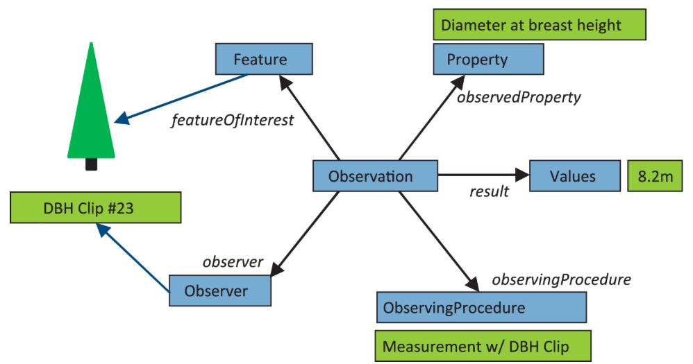

== Brief Overview of the O&M Standard
:doctype: book
:lang: en
:imagesdir: images

=== Observation & Measurement 2011

Observation & Measurements (indexterm:[O&M]<<acr-om,O&M>>), jointly published by the Open Geospatial Consortium (indexterm:[OGC]<<acr-ogc,OGC>>) and ISO under the ISO 19156:2011 reference, is a conceptual standard that defines a common schema for describing scientific observations and their results.

It is designed to be used in a wide variety of domains—meteorology, hydrology, oceanography, environmental sciences—and to facilitate the exchange of data between scientific and technical communities.

The standard provides a natural language definition that serves as a guide for the entire model:

An *observation* is the process by which an *observer* applies a specific *procedure* to estimate a *property* of a *feature of interest* and produces a *result*.

[[fig-o-m-uml-data-model]]
.OM UML Data Model

Each term in bold corresponds to a formal interface in the model.

[[fig-o-m-2011-conceptual-model]]
.OM 2011 Conceptual Model
image::om-2011.png[<<acr-om,O&M>> 2011 Standard Diagram, align=center]

[cols="1,2,2", options="header"]
|===
| Interface | Role | indexterm:[PDSSP]<<acr-pdssp,PDSSP>> example

| Observation | The act of observing, located in time | A THEMIS acquisition on July 5, 2002
| FeatureOfInterest | The real-world object whose property is observed | The surface of Mars
| ObservableProperty | The physical property being measured | Brightness temperature in infrared
| Observer | The instrument or sensor that measures | THEMIS instrument
| Host | The platform carrying the instrument | Mars Odyssey spacecraft
| ObservingProcedure | The method or processing chain applied | Radiometric calibration (BTR)
| Deployment | TODO | TODO
|===

The **Observation** interface includes attributes that contextualize the act of observing in time and qualify its result:

[cols="1,2", options="header"]
|===
| Attribute | Description

| phenomenonTime | The moment when the observed phenomenon actually occurred
| resultTime | The moment when the result was produced or recorded
| validTime | The period during which the result is considered valid
| result | The value produced by the observation (of type Any: number, text, image, etc.)
| resultQuality | The quality or reliability of the result
| observationType | The category of observation performed
| parameter | Contextual parameters such as field of view angle, pressure, altitude
|===

The relationships to the five interfaces (featureOfInterest, observer, host, observingProcedure, observedProperty) are modeled as **associations**, not as attributes. This means that each entity has its own independent existence and can be shared among multiple observations.

=== Observation & Measurement 2023

The revised link:https://www.iso.org/standard/80364.html[ISO 19156:2023], jointly prepared with the Open Geospatial Consortium, introduces missing concepts from the previous version and provides clarifications on existing concepts and their relationships, while keeping the fundamental data model largely intact.

The 2011 version was primarily designed in the context of the <<acr-ogc,OGC>>'s *Sensor Web Enablement*, meaning it was intended for relatively homogeneous environmental sensor networks. Twelve years of use across much broader domains—planetary sciences, medicine, industrial IoT—revealed gaps and ambiguities that the 2023 revision addresses.

The name of the standard itself subtly reflects this evolution: it shifts from *Observations and Measurements* to *Observations, Measurements, and Samples (indexterm:[OMS]<<acr-oms,OMS>>)*, signaling that physical samples are now a first-class concept in the model, rather than an appendix.

The 2011 conceptual schema is fully preserved. Any profile or implementation compliant with the 2011 version remains conceptually compatible with the 2023 version.

The Five Addressed Gaps:

* Formal Collection Absence : In 2011, there was no formal way to indicate that a set of observations constituted a coherent whole with its own metadata—such as a measurement campaign, a time series, or a mission dataset. This gap forced each implementation to invent its own grouping concept, which was incompatible with others. The 2023 version introduces `AbstractObservationCollection`, a class that groups observations and shares common characteristics with them via `AbstractObservationCharacteristics`.
* Rigid Result Typing : In 2011, each result type required a dedicated subclass: `OM_Measurement` for a number, `OM_CategoryObservation` for text, and `OM_ComplexObservation` for a structure. This rigid hierarchy made extending the model complex and produced schemas that were difficult to maintain. The 2023 version adopts "soft-typing": the observation type is carried by an `observationType` attribute rather than the class hierarchy, providing much more flexibility without losing expressiveness.
* Ambiguity of Feature of Interest : In scientific practice, an intermediate sample is often observed to learn something about a real object of interest. For example, a rover collects a fragment of Martian rock to analyze its mineralogical composition—the fragment is what is directly measured, while Mars is what is ultimately being characterized. In 2011, a single `featureOfInterest` association did not allow distinguishing between these two levels. The 2023 version explicitly introduces `proximateFeatureOfInterest` for the directly measured object and `ultimateFeatureOfInterest` for the final object of interest.
* Absence of Deployment : How to model that an instrument is installed on a platform at a given date, in a specific configuration, and then replaced or reconfigured? In 2011, the relationship between `Observer` and `Host` was a simple association without temporality or parameterization. The 2023 version introduces `Deployment` to formalize this link over time, which is essential for space missions or long-lived ground-based telescopes where instruments evolve.
* Redesign of Sample Types : In 2011, `SF_SamplingFeature` types were classified according to their topological dimension—point, curve, surface, or volume. This classification was suitable for terrestrial geospatial data but poorly adapted to experimental sciences in general. The 2023 version reclassifies samples according to their physical nature: `SpatialSample` for objects located in space, `MaterialSample` for physical ex-situ samples, and `StatisticalSample` for statistical populations. This classification is immediately understandable for a chemist, biologist, or planetary scientist.

[[fig-o-m-2023-conceptual-model]]
.OM 2023 Conceptual Model
image::om-2023.png[<<acr-om,O&M>> 2023 Standard Diagram, align=center]
