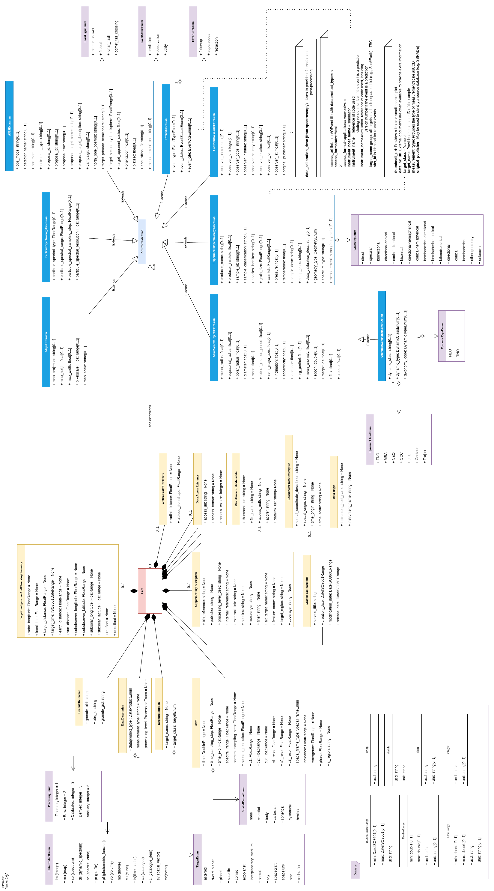
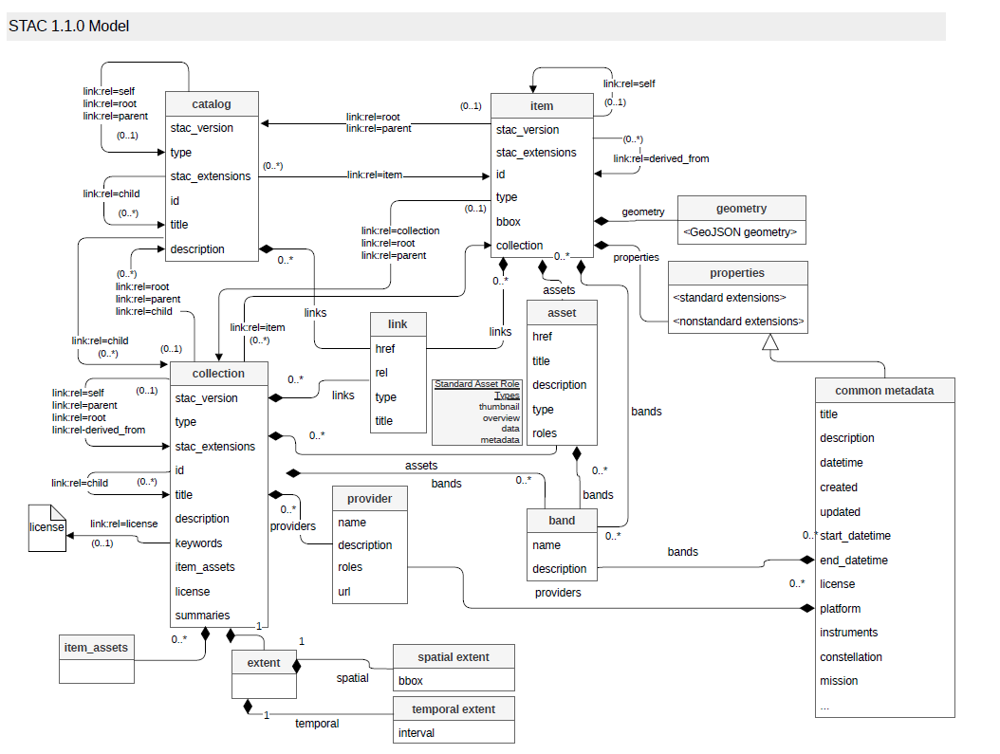

== Presentation of Reference Data Models

=== EPN Core

The indexterm:[EPN-TAP]<<acr-epn-tap,EPN-TAP>> data model, a standard of the International Virtual Observatory Alliance (indexterm:[IVOA]<<acr-ivoa,IVOA>>), is a comprehensive framework designed to facilitate the discovery and access of data related to the solar system. This model is integral to the <<acr-epn-tap,EPN-TAP>> protocol, which extends the <<acr-ivoa,IVOA>>'s Table Access Protocol (indexterm:[TAP]<<acr-tap,TAP>>) to provide standardized access to planetary science data.

The <<acr-epn-tap,EPN-TAP>> data model includes the <<acr-epn-tap,EPN-TAP>> metadata dictionary, which defines essential parameters for describing data products. These parameters cover various aspects such as temporal, spectral, spatial, and photometric characteristics, as well as the origin, content, and access methods of the data.

An <<acr-epn-tap,EPN-TAP>> service consists of a single table that describes a list of granules using the metadata dictionary. Each granule corresponds to a row in the table, while each parameter corresponds to a column. Only one data product can be described and linked per row of the table, supporting observations, simulations, or experimental data.

The global philosophy of <<acr-epn-tap,EPN-TAP>> is to describe all tables with a common set of mandatory parameters. This standardization allows for the seamless querying of multiple <<acr-epn-tap,EPN-TAP>> services together, enhancing interoperability and data accessibility across different platforms and disciplines. Several independent services can reside on a single server, further promoting efficient data management and collaboration within the scientific community.

[[fig-epn-core-uml-data-model]]
.EPN Core UML Data Model

[cols="1,3", options="header"]
|===
|Parameter |Description

|granule_uid
|Identifier for this row. This parameter is a primary key in `epn_core` tables, i.e., no two different rows may share the same `granule_uid`. There can be only one data file associated to a granule (plus possibly a thumbnail for quick-look purpose in a search interface). Basic ASCII characters are allowed, including internal spaces, except for the `#` character.

|obs_id
|Associates granules derived from the same data (e.g., various representations or processing levels). May be the ID of the original observation.

|granule_gid
|Associates granules of the same type (e.g., same map projection, or geometry data products). Think of it as a simple and convenient way to group or differentiate types of data. When several files relate to the same data, this parameter helps distinguishing them.

|dataproduct_type
|Describes the high-level scientific organization of the data product linked by the `access_url` parameter, or directly included in the table (in which case the value is `ci` for `catalogue_item`). <<acr-epn-tap,EPN-TAP>> defines several types. Data providers must select the type most adapted to their data. In complex situations, several types can be used in a hash-separated list.

|measurement_type
|Defines the physical quantities contained in the data, using UCDs (Cecconi and Louys et al., 2021). It relates to the reported quantity, not to the type of experiment. Only UCDs related to physical quantities can be used (e.g., `phys.absorption;em.opt.I` is eligible, while `pos.lunar.occult` is not). Used to provide indications to visualization/processing tools.

|processing_level
|Provides a quick evaluation of data readiness level. <<acr-epn-tap,EPN-TAP>> uses a simplified scheme. Several classifications are in use in different contexts. <<acr-epn-tap,EPN-TAP>> uses the CODMAC/PDS3 levels but removes intermediate calibration levels. "Partially calibrated" data collections are generally considered as not calibrated. "Ancillary" data include extra information documenting the measurements.

|processing_level_desc
|Optional parameter to provide a specific encoding of processing levels related to a data collection, or more details about partial calibrations.

|target_name
|Identifies a target by name or ID. The target may be any Solar System body, exoplanet, planetary sample, or meteorite, plus in some cases astronomical objects or spacecraft. Alternative names of the same target must not be listed here but may be provided through the optional `alt_target_name` parameter. This parameter is case-sensitive.

|target_class
|Identifies the type of the target. Solar System bodies are defined without ambiguity by the couple `target_class` and `target_name`. In other cases, targets may have no proper name, but the `target_class` parameter must contain a value in all cases.

|time_min, time_max
|Provide the date and time of acquisition in the observer frame. Always provided in UTC and formatted in Julian Days (double precision). <<acr-epn-tap,EPN-TAP>> uses standard indexterm:[JD]<<acr-jd,JD>> to avoid ambiguity with time origin. Double precision floats ensure an accuracy on the order of 1 ms.

|time_sampling_step (min/max)
|Provide the sampling step in seconds for measurements of dynamical phenomena and computations. This is the time between 2 successive measurements or data, mostly relevant when the measurements are regularly spaced.

|time_exp (min/max)
|Correspond to the integration time (or exposure time) of measurements in seconds. Provide an estimate of the time resolution for dynamical phenomena, as well as an indication of relative S/N ratio inside a given data collection.

|spectral_range (min/max)
|Define the upper and lower bounds of the spectral domain of the data. Expressed on a frequency scale in Hertz. The spectral range and associated parameters only apply to electromagnetic waves. Recommended to fill even for images obtained through a filter.

|spectral_sampling_step (min/max)
|Provide the spectral separation between the centers of two adjacent filters or channels. Expressed on a frequency scale in Hz. Most relevant for radio observations with regular sampling.

|spectral_resolution (min/max)
|Provide the (dimensionless) resolving power λ/∆λ = ν/∆ν. Mostly intended to provide an order of magnitude, e.g., to distinguish between Fourier spectrometers, grating spectrometers, or filter cameras.

|c1 (min/max)
|Provide up to three spatial coordinates of the measured target. Coordinates depend on the `spatial_frame_type` parameter. All services must handle three spatial coordinates, even if the third one is always set to NULL. Some coordinates are measured along a circle and must handle 0-meridian crossing.

|c2 (min/max)
|-

|c3 (min/max)
|-

|c1_resol (min/max)
|Provide a simple estimate of the resolution in the same frame/units as c1/c2/c3. For instance, if `spatial_frame_type = celestial`, it can accommodate the FWHM of the PSF on the sky (in degrees).

|c2_resol (min/max)
|-

|c3_resol (min/max)
|-

|spatial_frame_type
|2D angles in body-fixed frame: longitude c1 and latitude c2, plus possibly altitude as c3. A planetocentric system with eastward longitudes in the range (0, 360)° is required for service interoperability. IAU 2009 planetocentric convention applies. Parameter c3 is measured above the reference ellipsoid and can be <0 for interiors.

|incidence (min/max)
|Define the upper and lower bounds of the incidence angle range in the data (Solar Zenith Angle). Always indicated in decimal degrees, usually ranging from 0 to 90° (with 0° indicating the normal to the surface).

|emergence (min/max)
|Define the upper and lower bounds of the emergence, emission, or viewing angle range in the data. Always indicated in decimal degrees, usually ranging from 0 to 90° (with 0° indicating the normal to the surface).

|phase (min/max)
|Define the upper and lower bounds of the phase angle range in the data (scattering angle − 180°, or light source−target-observer angle). Always indicated in decimal degrees, may range from -180 to 180° (with 0° corresponding to opposition).

|s_region
|Introduces a footprint as a contour. Should be given for geolocalized data products in 2D, most notably on the sky (using RA, Dec) or on planetary surfaces (using E longitude, latitude). Coordinates are provided in the same reference system as c1/c2 parameters.

|coverage
|Introduces another type of footprint, with potential extension to time coverage. When both `s_region` and `coverage` are present, care must be taken that they are consistent.

|instrument_host_name
|Provides the name of the observatory, spacecraft, or facility that performed the measurements. A hash-separated-list of host names must be provided for integrated data sets. In the <<acr-epn-tap,EPN-TAP>> table, the acronym is preferred to the full name.

|instrument_name
|Identifies the instrument(s) that acquired the data. A hash-separated-list of instruments must be provided for integrated data products. Service providers are invited to include multiple values for instrument name, e.g., complete name and usual acronym.

|service_title
|The schema name of the service: provides a unique acronym for the service/table, constant throughout the service. Intended to identify the source of the data in later stages, e.g., when handling multiservice results. Special/unusual characters must be avoided (including `#`, `?`, etc.).

|creation_date
|Provides the date when the granule was introduced in the service.

|modification_date
|Provides the date when the granule was last updated. Intended to speed up mirroring between sites and to flag recalibrations. When unknown or not relevant, the creation date is replicated here.

|release_date
|Provides the date when the granule becomes public. Intended to support a proprietary period. When unknown or not relevant, the creation date is replicated here.
|===

=== Nasa ODE

The indexterm:[ODE]<<acr-ode,ODE>> (Orbital Data Explorer) data model from NASA provides a comprehensive framework for describing planetary data products, their metadata, and associated files. This model supports querying and discovery of planetary science data through standardized interfaces.

==== ProductFile Class

The ProductFile class represents a single downloadable file associated with a indexterm:[PDS]<<acr-pds,PDS>> product.

[[fig-productfile-class-diagram]]
.ProductFile Class Diagram
[plantuml,ode-product-file-diagram]
....
@startuml

class ProductFile {
  + FileName
  + Type
  + KBytes
  + URL
  + Description
  + Creation_date
}

@enduml
....

[cols="1,3", options="header"]
|=== 
|Attribute |Description

|*FileName* |Name of the file (without path).

|*Type* |<<acr-ode,ODE>> classification: "Browse", "Product", "Label", etc.

|*KBytes* |File size in kilobytes.

|*URL* |Download URL for the file.

|*Description* |Human-readable description of the file content.

|*Creation_date* |ISO 8601 date string when the file was created.
|=== 

The ProductFile class provides metadata for individual files associated with <<acr-pds,PDS>> products, including classification, size, access information, and descriptive content.

==== PdsRecordModel Class

The PdsRecordModel class represents a full metadata record for a single planetary data product. It contains comprehensive information about the product, including identifiers, temporal data, geometry, observation details, and file access.

[[fig-pdsrecordmodel-class-diagram]]
.PdsRecordModel Class Diagram
[plantuml,ode-pds-record-diagram]
....
@startuml

class PdsRecordModel {
  + ode_id
  + pdsid
  + ihid
  + iid
  + pt
  + LabelFileName
  + Target_name
  + Data_Set_Id
  + Product_creation_time
  + Product_release_date
  + Observation_time
  + UTC_start_time
  + UTC_stop_time
  + Product_title
  + Product_version_id
  + Label_product_type
  + Description
  + Comment
  + ODE_notes
  + Easternmost_longitude
  + Maximum_latitude
  + Minimum_latitude
  + Westernmost_longitude
  + Footprint_geometry
  + Footprint_C0_geometry
  + Footprint_GL_geometry
  + Footprint_NP_geometry
  + Footprint_SP_geometry
  + Footprints_cross_meridian
  + Pole_state
  + Center_georeferenced
  + Center_latitude
  + Center_longitude
  + Center_latitude_text
  + Center_longitude_text
  + BB_georeferenced
  + Easternmost_longitude_text
  + Maximum_latitude_text
  + Minimum_latitude_text
  + Westernmost_longitude_text
  + Footprint_souce
  + Observation_id
  + Observation_number
  + Observation_type
  + Activity_id
  + Start_orbit_number
  + Stop_orbit_number
  + SpaceCraft_clock_start_count
  + SpaceCraft_clock_stop_count
  + Emission_angle
  + Emission_angle_text
  + Phase_angle
  + Phase_angle_text
  + Incidence_angle
  + Incidence_angle_text
  + Map_resolution
  + Map_resolution_text
  + Map_scale
  + Map_scale_text
  + Solar_distance
  + Solar_distance_text
  + Solar_longitude
  + Predicted_dust_opacity
  + Predicted_dust_opacity_text
  + PDSVolume_Id
  + RelativePathtoVol
  + Producer_id
  + Product_name
  + label
  + USGS_Sites
  + PDS4LabelURL
  + LabelURL
  + FilesURL
  + ProductURL
  + External_url
  + External_url2
  + External_url3
  + Product_files
  + browse
  + thumbnail
}

@enduml
....

===== PdsRecordModel Core Attributes

[cols="1,3", options="header"]
|=== 
|Attribute |Description

|*ode_id* |An internal <<acr-ode,ODE>> product identifier. NOTE: This id is assigned by <<acr-ode,ODE>> when the product is added to the <<acr-ode,ODE>> metadata database. It is generally stable but can be changed when the <<acr-ode,ODE>> metadatabase is rebuilt. In general, this id should only be used shortly after acquisition.

|*pdsid* |<<acr-pds,PDS>> Product Id

|*ihid* |Instrument host id. See <<acr-ode,ODE>> for valid instrument host ids

|*iid* |Instrument id. See <<acr-ode,ODE>> for valid instrument ids

|*pt* |<<acr-ode,ODE>> Product type. This is <<acr-ode,ODE>>'s product type. In general, it is obtained from the label but can be changed depending on whether a label has a product type, whether there are other products in the same instrument with the same product type in the label, etc. If this is not the same product type as in the label, the return will include a Label_Product_Type value as well.

|*LabelFileName* |The file name of the product label

|*Target_name* |Product target (example: Mars)

|*Data_Set_Id* |<<acr-pds,PDS>> Data Set Id
|=== 

===== PdsRecordModel Temporal Attributes

[cols="1,3", options="header"]
|=== 
|Attribute |Description

|*Product_creation_time* |Product creation time (UTC)

|*Product_release_date* |Product release date

|*Observation_time* |Observation time (mid-point between the start and end of the observation)

|*UTC_start_time* |Observation start time in UTC

|*UTC_stop_time* |Observation end time in UTC
|=== 

===== PdsRecordModel Descriptive Attributes

[cols="1,3", options="header"]
|=== 
|Attribute |Description

|*Product_title* |Product title

|*Product_version_id* |Product version

|*Label_product_type* |Label product type (if it exists in the label and is different from the ODE_Product_Type)

|*Description* |Label description

|*Comment* |Any associated comment

|*ODE_notes* |A note about how data has been entered into <<acr-ode,ODE>>
|=== 

===== PdsRecordModel Geometry Attributes

[cols="1,3", options="header"]
|=== 
|Attribute |Description

|*Easternmost_longitude* |Longitude 0-360 Easternmost longitude of the footprint

|*Maximum_latitude* |Planetocentric maximum latitude of the footprint

|*Minimum_latitude* |Planetocentric minimum latitude of the footprint

|*Westernmost_longitude* |Longitude 0-360 Westernmost longitude of the footprint

|*Footprint_geometry* |Cylindrical projected planetocentric, longitude 0-360 product footprint in WKT format. Only if there is a valid footprint. Note - this is a cylindrical projected footprint. The footprint has been split into multiple polygons when crossing the 0/360 longitude line and any footprints that cross the poles have been adjusted to add points to and around the pole. It is meant for use in cylindrical projects and is not appropriate for spherical displays.

|*Footprint_C0_geometry* |Planetocentric, longitude -180-180 product footprint in WKT format. Only if there is a valid footprint. Note - this is a cylindrical projected footprint. The footprint has been split into multiple polygons when crossing the -180/180 longitude line and any footprints that cross the poles have been adjusted to add points to and around the pole. It is meant for use in cylindrical projects and is not appropriate for spherical displays.

|*Footprint_GL_geometry* |Planetocentric, longitude 0-360 product footprint in WKT format. Only if there is a valid footprint. This is not a projected footprint.

|*Footprint_NP_geometry* |Stereographic north polar projected footprint in WKT format. Only if there is a valid footprint. This footprint has been projected into meters in stereographic north polar projection.

|*Footprint_SP_geometry* |Stereographic south polar projected footprint in WKT format. Only if there is a valid footprint. This footprint has been projected into meters in stereographic south polar projection.

|*Footprints_cross_meridian* |T if the footprint crosses the 0/360 longitude line

|*Pole_state* |String of "none", "north", or "south"
|=== 

===== PdsRecordModel Center Coordinates Attributes

[cols="1,3", options="header"]
|=== 
|Attribute |Description

|*Center_georeferenced* |T if the product has a footprint center

|*Center_latitude* |Planetocentric footprint center latitude

|*Center_longitude* |Longitude 0-360 center longitude

|*Center_latitude_text* |Text found in the center latitude label keyword if the center latitude is not a valid number

|*Center_longitude_text* |Text found in the center longitude label keyword if the center longitude is not a valid number
|=== 

===== PdsRecordModel Bounding Box Attributes

[cols="1,3", options="header"]
|=== 
|Attribute |Description

|*BB_georeferenced* |T if the product has a footprint bounding box

|*Easternmost_longitude_text* |Text found in the easternmost longitude label keyword if the easternmost longitude is not a valid number

|*Maximum_latitude_text* |Text found in the maximum latitude label keyword if the maximum latitude is not a valid number

|*Minimum_latitude_text* |Text found in the minimum latitude label keyword if the minimum latitude is not a valid number

|*Westernmost_longitude_text* |Text found in the westernmost longitude label keyword if the westernmost longitude is not a valid number

|*Footprint_souce* |A brief description of where the footprint came from
|=== 

===== PdsRecordModel Observation Attributes

[cols="1,3", options="header"]
|=== 
|Attribute |Description

|*Observation_id* |Identifies a scientific observation within a dataset.

|*Observation_number* |Monotonically increasing ordinal counter of the EDRs generated for a particular OBSERVATION_ID.

|*Observation_type* |Identifies the general type of an observation

|*Activity_id* |Label Activity id

|*Start_orbit_number* |Start orbit number

|*Stop_orbit_number* |End orbit number

|*SpaceCraft_clock_start_count* |Spacecraft clock start

|*SpaceCraft_clock_stop_count* |Spacecraft clock end
|=== 

===== PdsRecordModel Geometry-Derived Angles

[cols="1,3", options="header"]
|=== 
|Attribute |Description

|*Emission_angle* |Emission angle

|*Emission_angle_text* |Emission angle text from the product label

|*Phase_angle* |Phase angle

|*Phase_angle_text* |Phase angle text from the product label

|*Incidence_angle* |Incidence angle

|*Incidence_angle_text* |Incidence angle text from the product label
|=== 

===== PdsRecordModel Map Projection Attributes

[cols="1,3", options="header"]
|=== 
|Attribute |Description

|*Map_resolution* |Map resolution

|*Map_resolution_text* |Map resolution text from the product label

|*Map_scale* |Map scale

|*Map_scale_text* |Map scale text from the product label
|=== 

===== PdsRecordModel Solar/Atmospheric Attributes

[cols="1,3", options="header"]
|=== 
|Attribute |Description

|*Solar_distance* |Solar distance

|*Solar_distance_text* |Solar distance text from the product label

|*Solar_longitude* |Solar longitude

|*Predicted_dust_opacity* |Predicted dust opacity

|*Predicted_dust_opacity_text* |Predicted dust opacity text
|=== 

===== PdsRecordModel Archive/Volume Attributes

[cols="1,3", options="header"]
|=== 
|Attribute |Description

|*PDSVolume_Id* |Volume Id

|*RelativePathtoVol* |The relative path from the volume root to the product label file

|*Producer_id* |Producer id

|*Product_name* |Product name

|*label* |Complete product label for PDS3 product labels

|*USGS_Sites* |A USGS site that this product's footprint partially or completely covers
|=== 

===== PdsRecordModel URL Attributes

[cols="1,3", options="header"]
|=== 
|Attribute |Description

|*PDS4LabelURL* |Pointer to PDS4 XML label for PDS4 products

|*LabelURL* |URL to the product label

|*FilesURL* |URL to the product files

|*ProductURL* |URL to the product

|*External_url* |URL to an external reference to the product (e.g. the HiRISE site)

|*External_url2* |URL to a second external reference to the product (e.g. the HiRISE site)

|*External_url3* |URL to a third external reference to the product (e.g. the HiRISE site)
|=== 

===== PdsRecordModel File Attributes

[cols="1,3", options="header"]
|=== 
|Attribute |Description

|*Product_files* |Dictionary of file lists (ProductFile objects) associated with the product

|*browse* |If there is an <<acr-ode,ODE>> browse image - returns a base64 string of the PNG image

|*thumbnail* |If there is an <<acr-ode,ODE>> thumbnail image - returns a base64 string of the PNG image
|=== 

The PdsRecordModel class inherits from the indexterm:[O&M]<<acr-om,O&M>> Observation model and extends it with comprehensive NASA-specific metadata for planetary data products, including temporal, geometric, observational, and archival information.

==== IIPTSetModel Class

The IIPTSetModel class represents a single instrument/product-type combination from an <<acr-ode,ODE>> `query=iipt` response. It provides metadata about the instrument, product type, and valid search parameters for that combination.

[[fig-iiptsetmodel-class-diagram]]
.IIPTSetModel Class Diagram
[plantuml,ode-iipt-set-diagram]
....
@startuml

class IIPTSetModel {
  + ODEMetaDB
  + IHID
  + IHName
  + IID
  + IName
  + PT
  + PTName
  + DataSetId
  + ValidEmissionAngles
  + ValidPhaseAngles
  + ValidIncidenceAngles
  + ValidSolLongs
  + ValidFootprints
  + ValidObservationTimes
  + ValidTargets
  + NumberProducts
  + MinOrbit
  + MaxOrbit
  + MinObservationTime
  + MaxObservationTime
  + MinProductId
  + MaxProductId
  + NumberObservations
  + SpecialValue1
  + MinSpecialValue1
  + MaxSpecialValue1
  + SpecialValue2
  + MinSpecialValue2
  + MaxSpecialValue2
}

@enduml
....

===== IIPTSetModel Attributes

[cols="1,3", options="header"]
|=== 
|Attribute |Description

|*ODEMetaDB* |<<acr-ode,ODE>> Meta DB – can be used as a Target input

|*indexterm:[IHID]<<acr-ihid,IHID>>* |Instrument Host Id

|*IHName* |Instrument Host Name

|*indexterm:[IID]<<acr-iid,IID>>* |Instrument Id

|*IName* |Instrument Name

|*indexterm:[PT]<<acr-pt,PT>>* |Product Type

|*PTName* |Product Type Name

|*DataSetId* |Data Set Id
|=== 

===== IIPTSetModel Filter Validity Attributes

[cols="1,3", options="header"]
|=== 
|Attribute |Description

|*ValidEmissionAngles* |True if valid Emission Angles exist for searches

|*ValidPhaseAngles* |True if valid Phase Angles exist for searches

|*ValidIncidenceAngles* |True if valid Incidence Angles exist for searches

|*ValidSolLongs* |True if valid Solar Longitudes exist for searches

|*ValidFootprints* |True if valid Footprints exist for searches

|*ValidObservationTimes* |True if valid Observation Times exist for searches

|*ValidTargets* |Set of valid target values for the Target query parameter for a given instrument host, instrument, product type
|=== 

===== IIPTSetModel Statistical Attributes

[cols="1,3", options="header"]
|=== 
|Attribute |Description

|*NumberProducts* |Number of products with this instrument host/instrument/product type

|*MinOrbit* |Minimum orbit value for all products with this instrument host/instrument/product type

|*MaxOrbit* |Maximum orbit value for all products with this instrument host/instrument/product type

|*MinObservationTime* |Minimum observation time value for all products with this instrument host/instrument/product type

|*MaxObservationTime* |Maximum observation time value for all products with this instrument host/instrument/product type

|*MinProductId* |Minimum product id value for all products with this instrument host/instrument/product type

|*MaxProductId* |Maximum product id value for all products with this instrument host/instrument/product type

|*NumberObservations* |Number of observation values found in the products (valid only for selected instrument host/instrument/product types)
|=== 

===== IIPTSetModel Special Values Attributes

[cols="1,3", options="header"]
|=== 
|Attribute |Description

|*SpecialValue1* |Name or description of special value 1 unique to this product set

|*MinSpecialValue1* |Minimum special value 1

|*MaxSpecialValue1* |Maximum special value 1

|*SpecialValue2* |Name or description of special value 2 unique to this product set

|*MinSpecialValue2* |Minimum special value 2

|*MaxSpecialValue2* |Maximum special value 2
|=== 

The IIPTSetModel class provides metadata about instrument and product type combinations, including information about which search parameters are valid and statistical information about the products in each combination.

=== DOI

The Digital Object Identifier (indexterm:[DOI]<<acr-doi,DOI>>) is, strictly speaking, a persistent identifier system built on the Handle System: it guarantees that a digital resource remains uniquely and durably referenceable and citable. On its own, a <<acr-doi,DOI>> is only a string; what turns it into a reference *data model* is the metadata schema attached to it at registration time.

For research data, this schema is the *DataCite Metadata Schema*. It is the model the Pole relies on to expose its datasets in a citable, machine-readable form when minting DOIs. The current version is Schema 4.7 (released March 2026); it defines a small set of mandatory properties, completed by recommended and optional ones.

The DataCite schema defines six mandatory properties that must be supplied for every <<acr-doi,DOI>>:

[cols="1,3", options="header"]
|===
|Property |Description

|Identifier
|The <<acr-doi,DOI>> itself, with `identifierType` set to `<<acr-doi,DOI>>`. Unique and persistent identifier of the resource.

|Creator
|The main entities responsible for producing the resource (person, organization, or instrument team). Used to build the citation.

|Title
|The name by which the resource is known.

|Publisher
|The entity that holds, archives, publishes, or otherwise makes the resource available. For the Pole, this is the publishing organization (CNES/indexterm:[PDSSP]<<acr-pdssp,PDSSP>>).

|PublicationYear
|The year the resource was made publicly available.

|ResourceType
|The nature of the resource, with the mandatory controlled attribute `resourceTypeGeneral` (e.g., `Dataset`, `Collection`).
|===

Several recommended and optional properties are particularly relevant to planetary data: `Date` (with a `dateType` such as `Collected`, `Created`, or `Issued`), `RelatedIdentifier` (qualified links to related products or observations), `GeoLocation` (place name, point, box, or polygon footprint), `FundingReference` (funder, award, programme), `Rights` (licence), `Version`, `Size`, and `Format`.

Because the Pole already captures most of this information through <<acr-epn-tap,EPN-TAP>>, indexterm:[STAC]<<acr-stac,STAC>>, and the <<acr-om,O&M>>-derived models, <<acr-doi,DOI>> registration does not require a separate model: it is essentially a *projection* of existing fields onto the DataCite properties. The table below summarizes this projection.

[cols="1,2", options="header"]
|===
|DataCite property |Source in the Pole's model

|Identifier (<<acr-doi,DOI>>)
|<<acr-doi,DOI>> minted for the dataset or collection

|Creator
|Data producers (`Producer_id`, instrument host / team)

|Title
|`Product_title` / <<acr-stac,STAC>> `title`

|Publisher
|Publishing organization (CNES/<<acr-pdssp,PDSSP>>)

|PublicationYear
|Year derived from `release_date`

|ResourceType (`Dataset`)
|`dataproduct_type`

|Date (`Collected` / `Issued` / `Created`)
|`time_min`/`time_max` / `release_date` / `creation_date`

|GeoLocation (polygon/box)
|`s_region` / `footprint_geometry`

|RelatedIdentifier
|`obs_id`, related products, `access_url`

|FundingReference
|`ContributiveWorksExtension` (`funding_source`, `programme_id`)

|Rights
|<<acr-stac,STAC>> `license`

|Version
|`Product_version_id`

|Size / Format
|`access_estsize` / `access_format`
|===

In this way, the <<acr-doi,DOI>>/DataCite layer provides the citability and long-term referenceability required by Open Science, while reusing the metadata already produced by the other reference models.

=== Open Science

Unlike the other sections of this chapter, Open Science is not a data model. It is a *framework of principles*: it does not define entities, attributes, or relationships, but rather states a set of requirements that any data model must satisfy in order to maximize the scientific and societal value of the data. These requirements are commonly summarized by the *indexterm:[FAIR]<<acr-fair,FAIR>>* principles — Findable, Accessible, Interoperable, Reusable — formalized by Wilkinson et al. (2016).

For this reason, Open Science is not implemented in the Pole through a dedicated model. Instead, the <<acr-fair,FAIR>> principles are jointly realized by the reference models presented elsewhere in this document. The following table makes this correspondence explicit.

[cols="1,3", options="header"]
|===
|<<acr-fair,FAIR>> principle |Realization in the Pole's model

|*Findable*
|Persistent, unique identifiers (<<acr-doi,DOI>>/DataCite, `granule_uid`, <<acr-stac,STAC>> Item `id`); rich and indexed metadata; standardized search interfaces (<<acr-epn-tap,EPN-TAP>>, <<acr-stac,STAC>> API).

|*Accessible*
|Retrieval by identifier through open, standard protocols (HTTP, <<acr-tap,TAP>>); direct access to products (`access_url`, <<acr-stac,STAC>> asset `href`); metadata that remain accessible even when the data themselves are still under embargo (`release_date`).

|*Interoperable*
|Shared vocabularies and formats: the <<acr-om,O&M>> semantic anchor, UCDs for physical quantities, IAU nomenclature for targets, WKT geometries, MIME types (`access_format`).

|*Reusable*
|Explicit licensing (<<acr-stac,STAC>> `license` field); detailed provenance (`ContributiveWorksExtension`: programme, funding source, collaboration; `processing_level`); life-cycle timestamps (`creation_date`, `modification_date`).
|===

Open Science therefore acts as the cross-cutting criterion that justifies the modeling choices of the Pole: the joint adoption of <<acr-epn-tap,EPN-TAP>>, <<acr-stac,STAC>>, and DataCite/<<acr-doi,DOI>> is precisely intended to guarantee <<acr-fair,FAIR>> compliance across the entire data value chain.

=== STAC

The SpatioTemporal Asset Catalog (<<acr-stac,STAC>>) data model is an open specification designed to enhance the discovery, accessibility, and interoperability of geospatial data. <<acr-stac,STAC>> provides a standardized way to describe and catalog geospatial assets, making it easier for users to search and utilize data from various providers. The model consists of four key components: Item, Collection, Catalog, and API. These components work together to organize and manage geospatial data, ensuring seamless integration into different systems and applications.

<<acr-stac,STAC>> supports a wide range of geospatial data types, including satellite imagery, SAR, LiDAR, hyperspectral imagery, point clouds, videos, and derived products like NDVI and Digital Elevation Models (indexterm:[DEM]<<acr-dem,DEMs>>). By adopting <<acr-stac,STAC>>, organizations can enhance the visibility and usability of their geospatial data, fostering better collaboration and innovation within the geospatial community. The <<acr-stac,STAC>> specification is widely adopted by major organizations such as NASA, USGS, Microsoft, ESRI, and Google, demonstrating its effectiveness and reliability in managing large-scale geospatial datasets.

The SpatioTemporal Asset Catalog (<<acr-stac,STAC>>) is a specification designed to improve the discoverability and accessibility of geospatial data. It provides a standardized way to describe geospatial assets, such as satellite imagery, drone data, and other observation data, using a simple and flexible JSON format. The <<acr-stac,STAC>> data model is built around three core components:

* <<acr-stac,STAC>> Item: Represents a single asset, such as an image or a data file, along with its metadata. Each <<acr-stac,STAC>> item should include essential properties like the asset's spatial and temporal extents.
* <<acr-stac,STAC>> Collections: A grouping of <<acr-stac,STAC>> items that share common characteristics, such as data from the same sensor or mission. Collections provide additional metadata that describe the group as a whole, facilitating the discovery of related datasets.
* <<acr-stac,STAC>> Catalog: Acts as a container for <<acr-stac,STAC>> items and collections. Catalogs can be nested, allowing for hierarchical organization of data. They provide structural elements to manage and navigate through large datasets.

<<acr-stac,STAC>> extensions enhance the core data model by adding domain-specific metadata fields. These extensions allow <<acr-stac,STAC>> to accommodate a wide range of geospatial data types and use cases.

Moreover, <<acr-stac,STAC>> can support more than just geolocated information. According to RFC 7946, section 3.2, the geometry can be null, enabling <<acr-stac,STAC>> to be used for any digital information by creating specific dictionaries. Here are some reasons for a null geometry:

* Non-georeferenced Data: The item represents a resource without a spatial footprint, such as a metadata table or a document.
* Unknown or Undetermined Geometry: During data ingestion, the geometry may not have been determined or extracted yet.
* Confidentiality: Some data providers may intentionally hide the geometry for confidentiality reasons.

[[fig-stac-uml-data-model]]
.STAC UML Data Model

