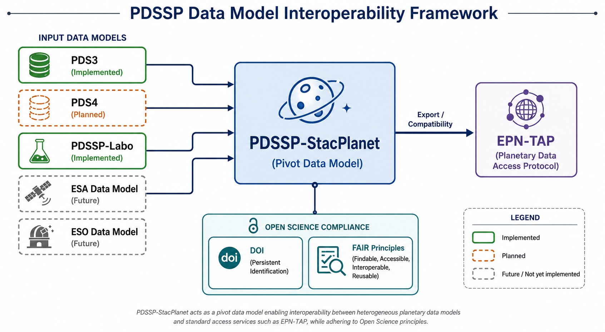

== Comparison Reference Data Model with O&M

This chapter compares the reference *data models* with the indexterm:[O&M]<<acr-om,O&M>> standard. Only EPN Core and NASA indexterm:[ODE]<<acr-ode,ODE>> are covered here: as discussed in Chapter 5, indexterm:[DOI]<<acr-doi,DOI>>/DataCite and Open Science are not data models in the same sense — <<acr-doi,DOI>>/DataCite is a citation metadata schema and Open Science is a framework of principles (indexterm:[FAIR]<<acr-fair,FAIR>>) — and therefore do not map onto the <<acr-om,O&M>> interfaces. The correspondences below present each EPN Core and <<acr-ode,ODE>> class as an extension of an <<acr-om,O&M>> interface.

[[fig-compatibility-of-reference-data-models-with-o-m]]
.Compatibility of Reference Data Models with OM

indexterm:[PDSSP]<<acr-pdssp,PDSSP>>-StacPlanet serves as a pivot data model that enables interoperability between heterogeneous planetary science data models and standard access protocols. Input models such as PDS3, <<acr-pdssp,PDSSP>>-Labo, and future ESA/ESO data models can be transformed into a common <<acr-pdssp,PDSSP>>-StacPlanet representation, which can then be exported to indexterm:[EPN-TAP]<<acr-epn-tap,EPN-TAP>>. The model also supports Open Science principles through <<acr-doi,DOI>>-based data citation and compliance with <<acr-fair,FAIR>> (Findable, Accessible, Interoperable, Reusable) guidelines.

The diagram below gives a consolidated view of how the three reference models — <<acr-epn-tap,EPN-TAP>>, NASA <<acr-ode,ODE>>, and indexterm:[STAC]<<acr-stac,STAC>> — each realize the seven <<acr-om,O&M>> interfaces. Reading it by row shows which standard covers a given <<acr-om,O&M>> concept; reading it by column shows the full <<acr-om,O&M>> coverage of each standard.

[[fig-alignment-of-epn-tap-nasa-ode-and-stac-with-the-o-m-interfaces]]
.Alignment of EPN-TAP, NASA ODE, and STAC with the OM Interfaces
[plantuml,om-alignment-overview]
....
@startuml
skinparam backgroundColor #FEFEFE
skinparam defaultFontSize 12
left to right direction
hide methods
hide fields
hide circle

skinparam package {
  BorderColor #555555
}

skinparam class<<OM>> {
  BackgroundColor #EEEEEE
  BorderColor #555555
}
skinparam class<<EPN>> {
  BackgroundColor #D6EAF8
  BorderColor #555555
}
skinparam class<<ODE>> {
  BackgroundColor #D5F5E3
  BorderColor #555555
}
skinparam class<<STAC>> {
  BackgroundColor #FEF9E7
  BorderColor #555555
}

package "O&M" {
  class "Host" <<OM>>
  class "Observation" <<OM>>
  class "FeatureOfInterest" <<OM>>
  class "Observer" <<OM>>
  class "ObservingProcedure" <<OM>>
  class "ObservableProperty" <<OM>>
  class "Result" <<OM>>
  class "ObservationCollection" <<OM>>
}

package "EPN-TAP" {
  class "EPNHost" <<EPN>>
  class "EPNObservation" <<EPN>>
  class "EPNFeatureOfInterest" <<EPN>>
  class "EPNObserver" <<EPN>>
  class "EPNObservingProcedure" <<EPN>>
  class "EPNObservableProperty" <<EPN>>
  class "EPNResult" <<EPN>>
  class "EPNObservationCollection" <<EPN>>
}

package "NASA ODE" {
  class "ODEHost" <<ODE>>
  class "ODEObservation" <<ODE>>
  class "ODEFeatureOfInterest" <<ODE>>
  class "ODEObserver" <<ODE>>
  class "ODEObservingProcedure" <<ODE>>
  class "ODEObservableProperty" <<ODE>>
  class "ODEResult" <<ODE>>
  class "ODEObservationCollection" <<ODE>>
}

package "STAC" {
  class "STACHost" <<STAC>>
  class "STACObservation" <<STAC>>
  class "STACFeatureOfInterest" <<STAC>>
  class "STACObserver" <<STAC>>
  class "STACObservingProcedure" <<STAC>>
  class "STACObservableProperty" <<STAC>>
  class "STACResult" <<STAC>>
  class "STACObservationCollection" <<STAC>>
}

"Host" <|.. "EPNHost"
"Host" <|.. "ODEHost"
"Host" <|.. "STACHost"

"Observation" <|.. "EPNObservation"
"Observation" <|.. "ODEObservation"
"Observation" <|.. "STACObservation"

"FeatureOfInterest" <|.. "EPNFeatureOfInterest"
"FeatureOfInterest" <|.. "ODEFeatureOfInterest"
"FeatureOfInterest" <|.. "STACFeatureOfInterest"

"Observer" <|.. "EPNObserver"
"Observer" <|.. "ODEObserver"
"Observer" <|.. "STACObserver"

"ObservingProcedure" <|.. "EPNObservingProcedure"
"ObservingProcedure" <|.. "ODEObservingProcedure"
"ObservingProcedure" <|.. "STACObservingProcedure"

"ObservableProperty" <|.. "EPNObservableProperty"
"ObservableProperty" <|.. "ODEObservableProperty"
"ObservableProperty" <|.. "STACObservableProperty"

"Result" <|.. "EPNResult"
"Result" <|.. "ODEResult"
"Result" <|.. "STACResult"

"ObservationCollection" <|.. "EPNObservationCollection"
"ObservationCollection" <|.. "ODEObservationCollection"
"ObservationCollection" <|.. "STACObservationCollection"
@enduml
....

include::061-epn-core.adoc[]

include::062-ode.adoc[]

include::063-stac.adoc[]
